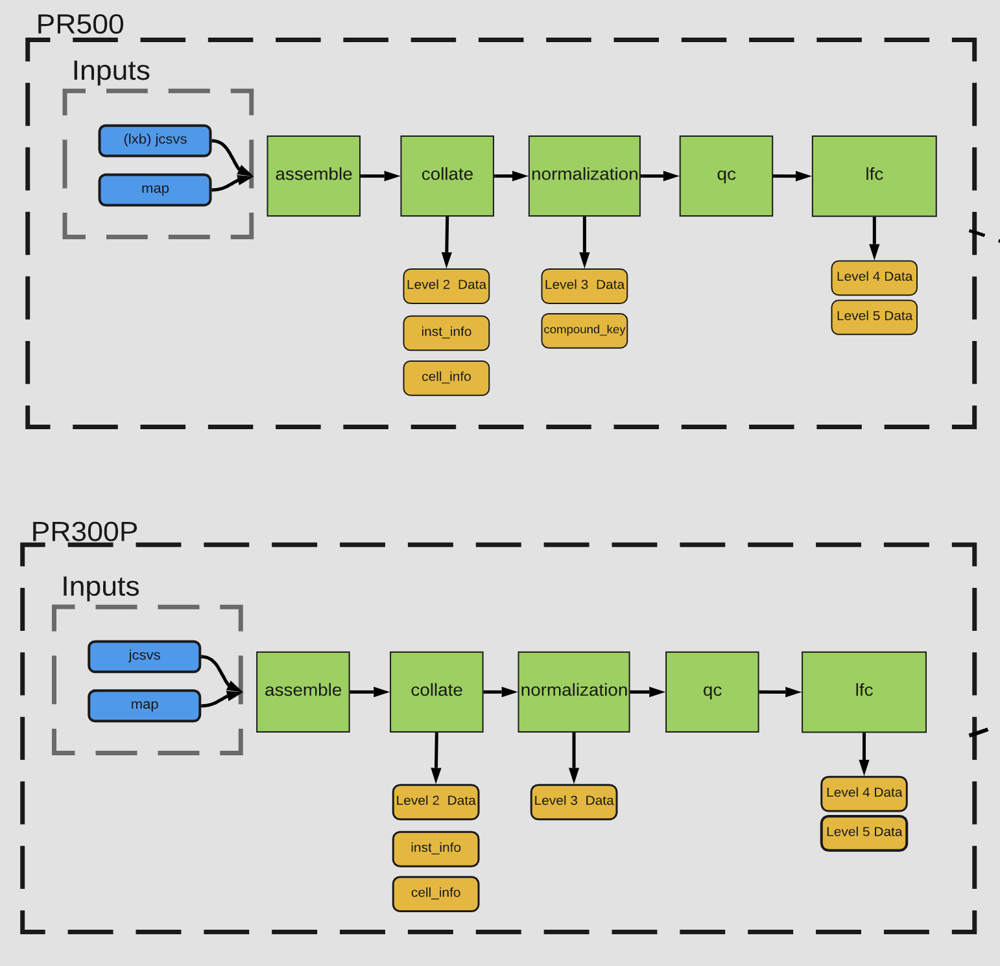
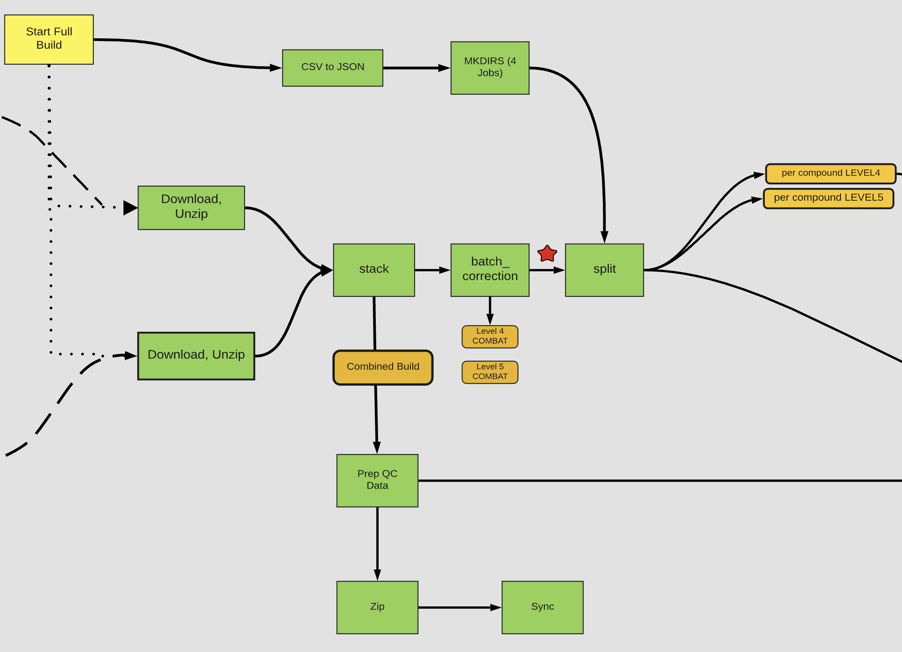
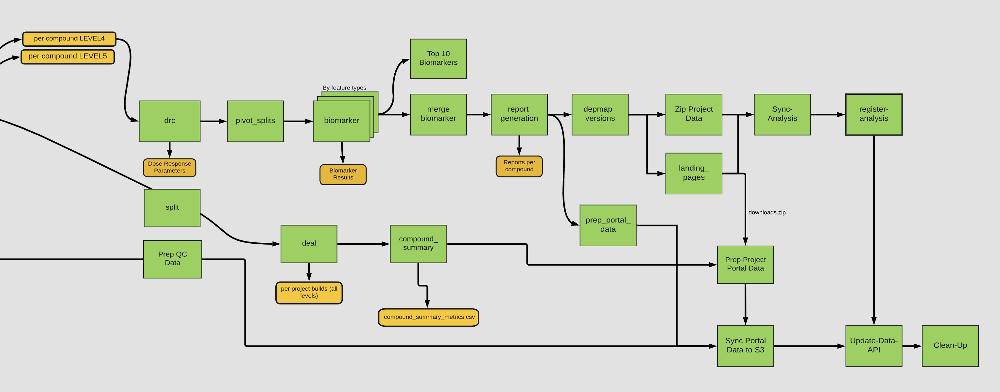

  
  

# MTS Pipeline (with Docker images)

Production version of the [PRISM](https://www.theprismlab.org/) MTS pipeline. For use with Luminex output or [clue.io](clue.io) datasets.

Each module is organized into its own sub-directory with associated Docker images on [Docker Hub](https://hub.docker.com/orgs/prismcmap/repositories). `README` files for each module are contained within their respective directories.

## Pre-requisites

### Docker

In order to run the Docker images (no R installation or local scripts required), install Docker following the instructions [here](https://docs.docker.com/get-docker/).

### R and RStudio (optional)

To run individual scripts or make modifications install [R](https://www.r-project.org/). [RStudio](https://www.rstudio.com/products/rstudio/), an IDE for R, is not required but is recommended for running and viewing R code.

## Running the MTS Pipeline 

The MTS Pipeline can be broken down into three stages (for the purpose of visualization):

1. Generating long form tables of luminescence and log-fold change (LFC) from raw plate map and luminescence (csv) data 
2. Running COMBAT batch-correction on collapsed LFC files 
3. Running dose response curve (drc) fitting, biomarker analysis, and generating interactive reports 

  

#### Stage 1:  Generating long form tables of luminescence and log-fold change (LFC) from raw plate map and luminescence (csv) data 

  

Our analytical pipeline processes data from plate maps files, which contain sample metadata such as dose, compound identifiers, and plate locations. In conjunction with these plate maps, we use jcsvs that store bead counts and median fluorescence intensity values for each sample across analytes (representing individual cell lines). This combined information is used to generate files for our various data levels:
  <ul>
    <li> Level 3: log2 mean fluorescence intensity, both raw and normalized (logMFI, logMFI_norm) </li>
    <li> Level 4: replicate level log-viability (LFC)  </li>
    <li> Level 5: replicated-collapsed (median) log-viability (LFC) </li>
  </ul>
The process for analysis for PR500 and PR300 is the same, however, they map to different cell sets and are therefore run in series. 

  

#### Stage 2: Running COMBAT batch-correction on collapsed LFC files 

  

The PR300 and PR500 build results are then  used as inputs to a combined analysis ending in report generation (next figure). After pre-processing, batch correction (COMBAT) is conducted in a pool-wise manner on Level 4 and Level 5 data as specified in [Johnson et al](https://pubmed.ncbi.nlm.nih.gov/16632515/). It is worth noting that for our new Extended PRISM screening (EPS), the initial results for pre-processing are incorporated into the MTS pipeline after batch correction, as denoted by the red star (dose responsive fitting, biomarker analysis, and reports are the same). 

 

#### Stage 3: Running dose response curve (drc) fitting, biomarker analysis, and generating interactive reports 

  

Level 4 data is subsequently fed into the drc module to acquire drc fitting parameters (i.e., AUC and IC50). Following this, drc parameters and Level 5 data are inputted into the biomarker module for univariate and multivariate analysis alongside cell line genomic feature data. Finally, the drc, biomarker, and Level 4/5 data are inputted into the report generation module to create reports, which are then uploaded onto our portal. 
It is important to note that the dose response and biomarker modules may take some time to run depending on your available hardware.

## A note about running locally

The MTS pipeline is run on AWS and therefore most modules are designed with AWS in mind. Some modules are also specifically for handling and moving around files on AWS. Therefore, while the Docker images are useful tools, it may be easier in some cases to run the R scripts individually when running locally
