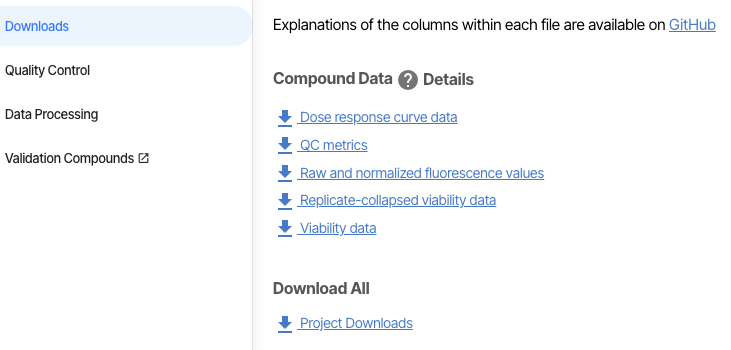

# Biomarker Module 

### Goal 
The goal of this README is to provide an overview on how to run the biomarker analysis locally. The biomarker analysis consists of a univariate analysis and multivariate analysis for the genomic features used in DepMap. 

### Files 

The file used for biomarker analysis is [biomarker.R](https://github.com/cmap/dockerized_mts/blob/master/biomarker/biomarkers.R) found in our [Github](https://github.com/cmap/dockerized_mts/tree/master). The biomarker analysis calls statistical functions found in [cdsr_models](https://github.com/broadinstitute/cdsr_models/tree/master/R). 

### Input Data 
To run the the biomarker.R function are the following

1. Log Fold Change (LFC) file
2. Dose Response Curve (DRC) file 
3. Quality Control (QC) file 

These files can be found in your project landing page under Reports and Downloads under the Compound Data tab. Specifically: 

1. LFC file: “Replicate-collapsed viability table”
2. DRC file: “Dose response curve data”
3. QC file: “QC metrics”

  

Once these files are downloaded, point them to the ‘lfc_path’, ‘drc_path’, and ‘qc_path’ within the biomarker.R file. 

### Running the biomarker.R file: 

Now you may run the biomarker.R file. The important variable to keep in mind is the ‘all_Y’ variable, which contains the cell line viabilities by compound and dose. Any customization or subsetting of cell lines should be done using this variable. The three biomarker functions are as follows: 

1. **Linear Associations**: computes the correlation coefficient and significance values between continuous genomic features for cancer cell lines and their respective viability profiles. The continuous genomic features are as follows: 
    1. Gene Expression (GE) 
    2. CRISPR (XPR) 
    3. Copy Number (CNA) 
    4. Metabolomics (MET) 
    5. Micro RNA (miRNA) 
    6. Repurposing Library (REP) 
    7. Proteomics (PROT) 
    8. Small hairpin RNA (shRNA) 
    
    
A pairwise correlation analysis is conducted through cdsr_models [linear_associations.R](https://github.com/broadinstitute/cdsr_models/blob/master/R/linear_association.R) which the biomarker.R function calls. 

2. **Discrete Associations**: computes the effect size and significance values between discrete genomic features for cancer cell lines and their respective viability profiles. the discrete genomic features are as follows: 
    1. Lineage (LIN) 
    2. Mutation (MUT) 

For these categorical features, a t-test is conducted between a specific LIN/MUT and all others to obtain effect size and significance through cdsr_models [discrete_associations.R](https://github.com/broadinstitute/cdsr_models/blob/master/R/discrete_association.R) which the biomarker.R function calls. While there is code in the biomarker.R function to control for GE for LIN, we do not computer and provide this data.

3. **Random Forest**: combines continuous and discrete genomic features in a multivariate analysis to predict the viabilities of cancer cell lines. The purpose of the random forest prediction is to assess feature importance in strong models. We consider valid models to have a model R2 > 0.2. There are two types of analyses run for random forest which vary based on input genomic features: 
    1. CCLE model (x-ccle): LIN + MUT + GE + CNA - these are features present in almost all available cell lines 
    2. All Model (x-all): x-ccle + PROT + XPR + miRNA + MET  - all features present in a subset of cell lines 

The random forest module used is the R Ranger found in our cdsr_models [random_forest](https://github.com/broadinstitute/cdsr_models/blob/master/R/random_forest.R) which the biomarker.R function calls. 
    
